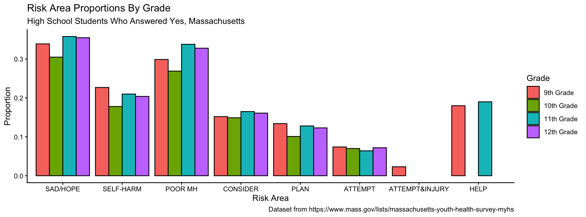
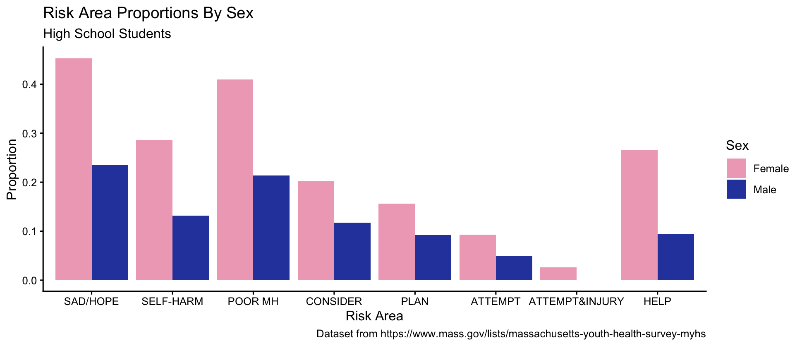
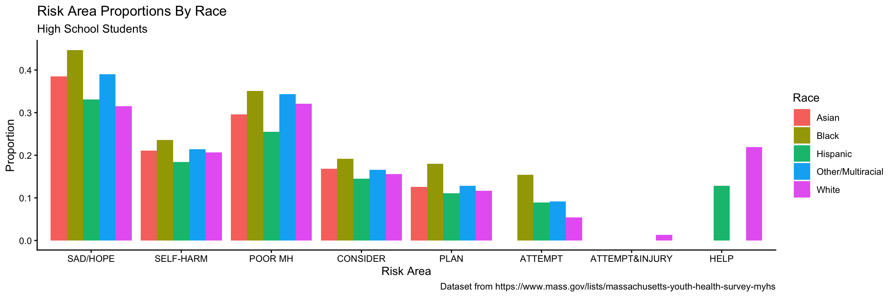
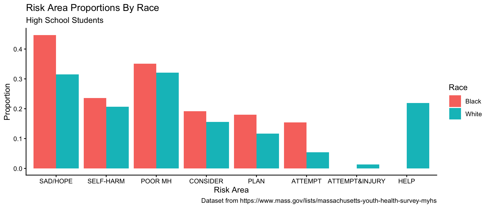

# Massachusetts Youth Risk Behavior Survey Analysis

Dataset from https://www.mass.gov/lists/massachusetts-youth-health-survey-myhs

According to the Massachusetts Department of Secondary and Elementary Education: 

*The YRBS was developed by the Centers for Disease Control and Prevention to monitor priority health risk behaviors that contribute to the leading causes of death, disease, injury, and social problems among youth. The Massachusetts Department of Elementary and Secondary Education (Department) — in collaboration with the Centers for Disease Control and Prevention (CDC) and the Massachusetts Department of Public Health (DPH) — conducts the Youth Risk Behavior Survey (YRBS) in randomly selected public high schools in every odd-numbered years. The Massachusetts YRBS (MYRBS) focuses on the major risk behaviors that threaten the health and safety of young people. This anonymous survey includes questions about tobacco use, alcohol and other drug use, sexual behaviors that might lead to unintended pregnancy or sexually transmitted disease, dietary behaviors, physical activity, and behaviors associated with intentional or unintentional injuries. Since 2007, the MYRBS has been conducted jointly with the Massachusetts Youth Health Survey  (MYHS) developed by DPH.*

### Data Description

This data was collected from schools with an in-person survey. For some of the data points, participation in the question did not create a large enough sample size, or the margin of error was too high. In these cases, the database is marked with **. 

## Analysis 

I used data from the 2023 survey to complete this analysis, as that was the most recent survey conducted and published. I used data from the document provided with the information and created a Google Sheet. I corrected some of the headers to have no spacing errors and deleted the confidence intervals. Then, I replaced all of the ** with NA to better fit the format of dataframes in R. 

I downloaded these sheets as CSV files and imported them into R. From here, I wrangled the data, including: 

  - Renaming categories to be more readable on graphs; "CONSIDER" = "Seriously considering suicide, past year", for example
  - Pivoting the two tables into long format
  - Combining the two dataframes
  - Converting the percentage points into proportions
  - Filtering for race, sex, and grade as demographics
  - Setting demographics as factors

## Visualization

I created graphs for each demographic type (race, sex, and grade). 

### Grade

### Sex

Here is a bar graph representing the proportion of students who answered yes to questions in the suicide and hopelessness section of the survey. 

| Short Version | Full Question |
| --- | --- |
| SAD/HOPE | Feeling sad or hopeless for 2+ weeks that they stopped doing usual activities, past year |
| SELF-HARM | Injuring oneself intentionally without wanting to die, past year |
| POOR MH | their mental health was not good always or most of the time during the previous 30 days |
| CONSIDER | Seriously considering suicide, past year |
| PLAN | Making a suicide plan, past year | 
| ATTEMPT | Attempting suicide, past year |
| ATTEMPT&INJURY | Attempting suicide that resulted in an injury, poisoning or overdose that had to be treated by a doctor or nurse, past year | 
| HELP | Asking for help from someone before their suicide attempt |
    

### Race

| Short Version | Full Question |
| --- | --- |
| SAD/HOPE | Feeling sad or hopeless for 2+ weeks that they stopped doing usual activities, past year |
| SELF-HARM | Injuring oneself intentionally without wanting to die, past year |
| POOR MH | their mental health was not good always or most of the time during the previous 30 days |
| CONSIDER | Seriously considering suicide, past year |
| PLAN | Making a suicide plan, past year | 
| ATTEMPT | Attempting suicide, past year |
| ATTEMPT&INJURY | Attempting suicide that resulted in an injury, poisoning or overdose that had to be treated by a doctor or nurse, past year | 
| HELP | Asking for help from someone before their suicide attempt |

